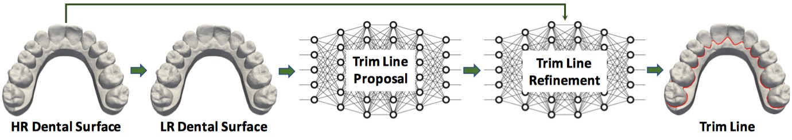
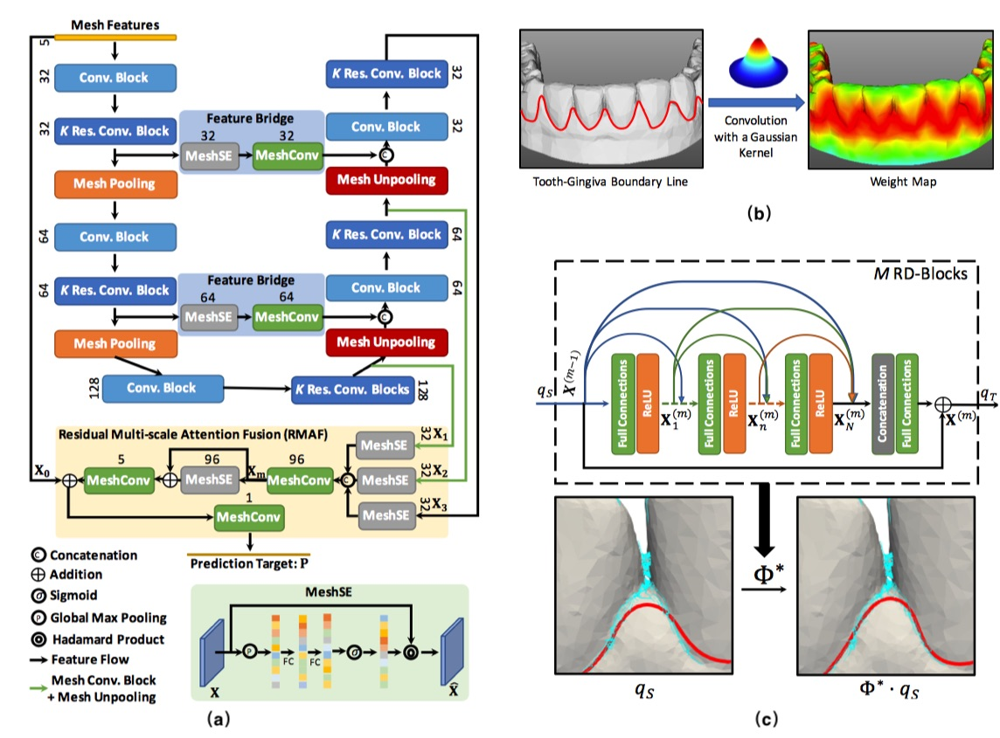
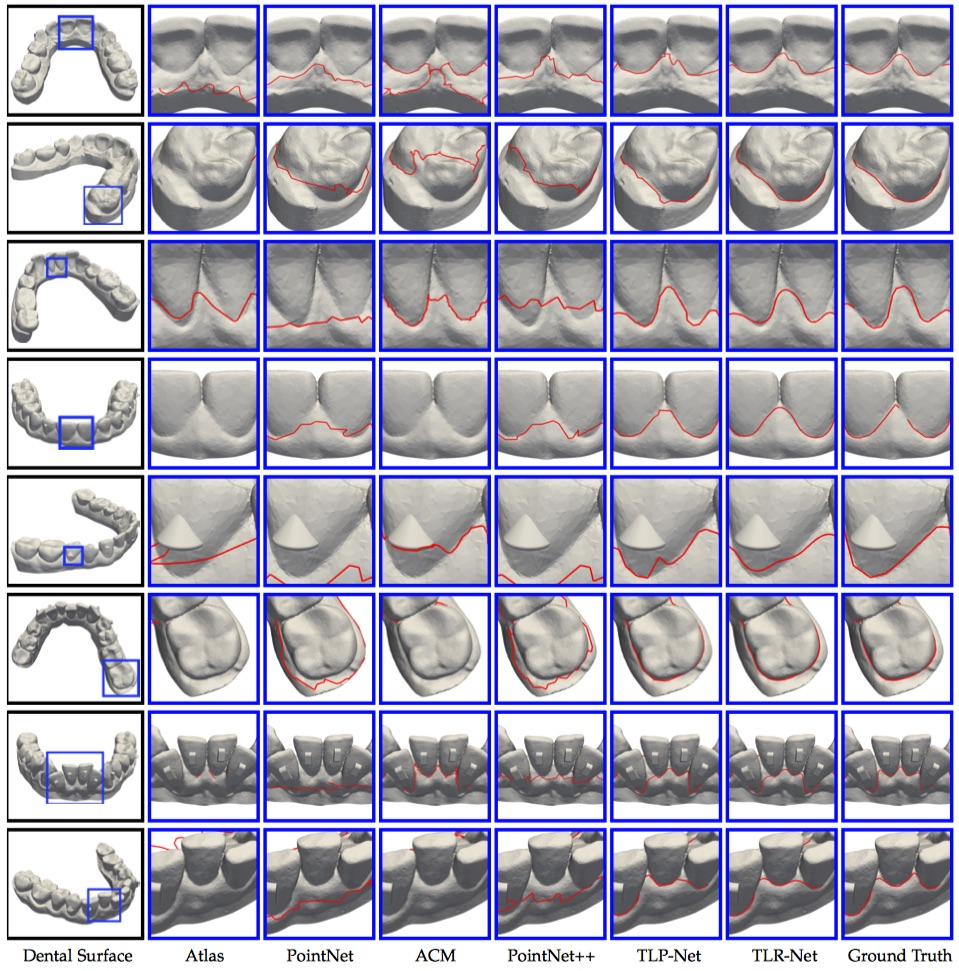

# Automatic Detection of Tooth-Gingiva Trim Lines on Dental Surfaces
## Brief
This is a repository for our paper entitled **Automatic Detection of Tooth-Gingiva Trim Lines on Dental Surfaces**.

In this work, we propose a two-stage geometric deep learning framework for automatically detecting tooth-gingiva trim lines from dental surfaces. Our framework consists of a trim line proposal network (TLP-Net) for predicting an initial trim line from the low-resolution dental surface as well as a trim line refinement network (TLR-Net) for refining the initial trim line with the information from the high-resolution dental surface. The contributions of our work lie in three-fold:

- We propose a novel two-stage framework to automatically detect tooth-gingiva trim lines from dental surface. Our framework directly provides high-quality trim line prediction by making full use of the HR dental surfaces, resolving the drawbacks of existing methods effectively. 
- We propose TLP-Net, an effective trim line proposal network that fuses the multi-scale features from a mesh U-Net with the proposed RMAF module. In addition, we propose feature bridge and trim line loss to further improve accuracy of trim line.
- We refine the initial trim line with our TLR-Net, which is a deep learning based LDDMM model with dense connections and is able to improve the accuracy of trim line by making full use of raw HR dental surfaces.
- Extensive experiments on a clinical dataset consisting of 200 dental surfaces demonstrate that our method is capable of accurately detecting tooth-gingiva trim line on dental surfaces and outperforms cutting-edge methods. Further ablation studies demonstrate the effectiveness of proposed modules and loss function.

## Model

A diagram of the proposed framework. In general, our framework consists of two stages, including one for trim line proposal and another for trim line refinement. The trim line proposal provides the initial trim line prediction with LR dental surfaces. The resulting trim line is then refined by trim line refinement by making full use of HR dental surface.




(a) An overview of the proposed trim line proposal network (TLP-Net). Our TLP-Net is based on a mesh U-Net with the proposed RMAF module for effective fusion of multi-scale feature and feature bridge modules for filling the gap between features at different levels. The number on the top of each block indicates the number of channels of output features. (b) A weight map generated from the tooth-gingiva trim line. The weight map is generated by convolving a Gaussian kernel with the toothgingiva trim line so that large weights are assigned to the regions near the trim line. (c) An overview of our trim line refinement network (TLR-Net). The TLR-Net is composed of M = 10 residual dense (RD) blocks.


## Results
We show the qualitative results for different testing subjects in the following figure:



As can be observed, both our TLP-Net and TLR-Net provide promising results, which are close to the ground truth. In contrast, the baseline methods, Atlas and ACM, show unstable performance. Atlas tends to fail when there is a large gap between the template and individual dental surface, while ACM suffers from the same issue and is easily influenced by the noisy edges of the dental surface.

## Usage
### Pipeline

In general, the whole pipeline involves three parts.

```python
1. Dental surface prepration via MeshLab
2. Trim line proposal via TLR-Net
3. Trim line refinement via TLR-Net
```
### Dental Surfance Preparation

This part is achieved with MeshLab and a preprocessing script:

```shell 
Coming soon!
```

### Tim Line Proposal

This part invovles two steps, including tooth segmentation and initil trim line extraction:

```python
Coming soon!
```

### Trim Line Refinement

This part is achived using the following commands:

```python
Coming soon!
```

### Dataset

```python
Coming soon!
```

## Acknowledge

We implment the code by referring to the following projects:

- Data prepration: https://github.com/cnr-isti-vclab/meshlab
- TLP-Net: https://github.com/ranahanocka/MeshCNN/
- TLR-Net: https://arxiv.org/pdf/2102.07951.pdf
